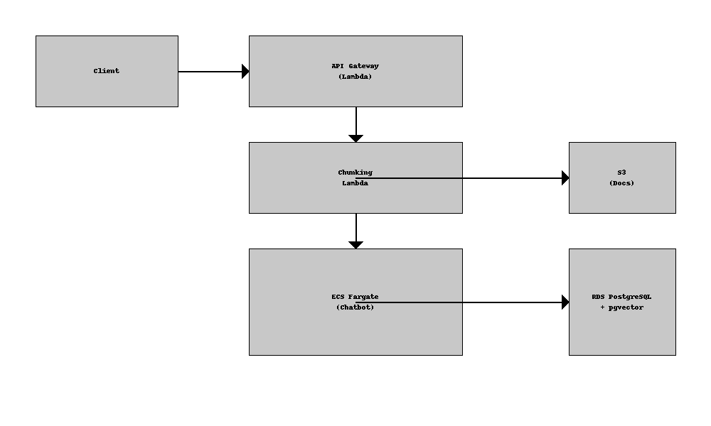

# DevSecOpsAI

[](https://github.com/your-org/DevSecOpsAI/actions)
[](LICENSE)

## 🚀 Description

DevSecOpsAI est un chatbot spécialisé en DevSecOps, conçu pour fournir :

* **Ingestion et indexation** de documentations DevSecOps via chunking.
* **Recherche sémantique** sur les documents grâce à un moteur vectoriel (pgvector).
* **Génération de snippets** Docker Compose pour faciliter vos déploiements.

Le projet est entièrement open source et vise un **coût AWS maximal de 20 €/mois**, avec une facturation à l’usage et une montée en charge automatique.

## 🎯 Objectifs

1. Ingestion et chunking de la documentation DevSecOps.
2. Stockage des vecteurs en base PostgreSQL avec extension pgvector.
3. API Chatbot pour recherche et génération de code.
4. Génération dynamique de fichiers Docker Compose.
5. Monitoring du budget AWS et alertes.
6. Sécurité by design : IAM minimal, chiffrement KMS, scans SAST/DAST.
7. CI/CD DevSecOps via GitHub Actions.

## 🏗️ Architecture



* **Compute** : AWS Lambda & ECS Fargate (t3.micro / Spot).
* **Stockage** : S3 pour les documents bruts, RDS PostgreSQL (free tier) pour les vecteurs.
* **Sécurité** : VPC privé, IAM roles stricts, KMS.
* **CI/CD** : GitHub Actions avec lint, tests et scans SAST.

## ⚙️ Stack Technique

* **Infrastructure as Code** : Terraform (ou AWS CDK).
* **Langage** : Python 3.10 (+ FastAPI pour l’API).
* **Vector database** : PostgreSQL + pgvector.
* **Orchestration** : AWS Lambda, ECS Fargate.
* **CI/CD** : GitHub Actions, Dependabot.

## 📦 Installation & Déploiement

1. Cloner le repo :

   ```bash
   git clone https://github.com/your-org/DevSecOpsAI.git
   ```
2. Configurer les variables AWS et budget :

   ```bash
   export AWS_PROFILE=devsecopsai
   ```
3. Déployer l’IaC :

   ```bash
   cd infrastructure && terraform init && terraform apply
   ```
4. Lancer les fonctions Lambda et l’API :

   ```bash
   cd src && uvicorn main:app --reload
   ```

## 🤝 Contribuer

Votre participation est la bienvenue ! Ouvrez une issue ou une PR en respectant nos templates :

* `.github/ISSUE_TEMPLATE.md`
* `.github/PULL_REQUEST_TEMPLATE.md`

## 🗺️ Roadmap

* [x] Cadrage & charte projet
* [ ] IaC minimale (VPC, S3, RDS)
* [ ] Ingestion & chunking docs
* [ ] Moteur vectoriel
* [ ] API Chatbot
* [ ] Génération Docker Compose
* [ ] UI Web & Documentation utilisateur

## 📝 Licence

Ce projet est sous licence MIT. Consultez le fichier [LICENSE](LICENSE) pour plus de détails.
